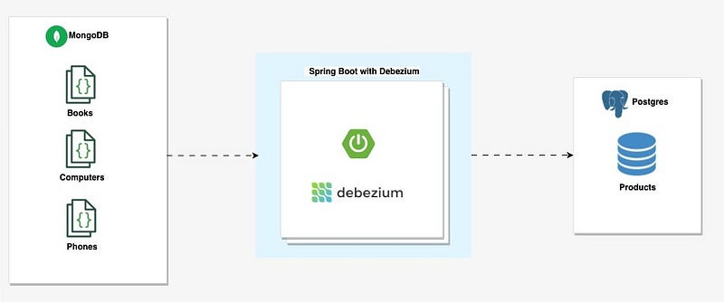

# Change Data Capture Made Easy: Debezium Integration with Spring Boot, MongoDB and Postgres

Streams changes from MongoDB into PostgreSQL in real time using the **Debezium Embedded Engine** inside a Spring Boot
application — no Kafka or Kafka Connect cluster required.



## How It Works

1. MongoDB runs as a 3-node replica set (`rs`) so that its oplog / change streams are available.
2. `DebeziumConnectorConfig` builds a `MongoDbConnector` configuration, storing connector offsets in PostgreSQL via
   `JdbcOffsetBackingStore` (so progress survives restarts).
3. `DebeziumSourceEventListener` starts the `DebeziumEngine` on a single-threaded executor at startup (`@PostConstruct`)
   and shuts it down cleanly on exit (`@PreDestroy`).
4. Every change event is parsed by `HandlerUtils` (operation, document id, source collection, payload) and handed to
   `ProductService`.
5. `ProductService` mirrors the change into the `product` table in PostgreSQL:

   | Mongo operation      | Action in PostgreSQL                         |
   |----------------------|----------------------------------------------|
   | `c` create / `r` read | Insert a new `Product`                       |
   | `u` update           | Look up by `mongoId` and update the row       |
   | `d` delete           | Delete the row matching `mongoId`             |

Watched databases and collections are configured in `application.yml`:

```yaml
database:
  include:
    list: test
collection:
  include:
    list: "test.books,test.computers,test.phones"
```

## Tech Stack

| Component     | Version                       |
|---------------|-------------------------------|
| Java          | 25                            |
| Spring Boot   | 4.1.0                         |
| Debezium      | 3.6.0.Final (embedded engine) |
| MongoDB       | 5.0.26 (replica set)          |
| PostgreSQL    | 18-alpine3.24                 |
| Build tool    | Gradle (wrapper included)     |

## Prerequisites

- JDK 25+
- Docker & Docker Compose

## Getting Started

### 1. Start the infrastructure

```bash
docker compose up -d
```

This starts:

| Service           | Host port | Notes                                                   |
|-------------------|-----------|---------------------------------------------------------|
| `mongo-primary`   | 27017     | Initiates the `rs` replica set via healthcheck           |
| `mongo-replica-1` | 27018     |                                                          |
| `mongo-replica-2` | 27019     |                                                          |
| `postgres-db`     | 5433      | user `postgres` / password `S3cret`, database `productDB` |
| `pgadmin`         | 5051      | Web UI for inspecting the CDC sink — see below            |

`src/main/resources/mongo-init.js` seeds the `test` database with `phones`, `computers`, and `books` collections.

> **Note:** the app also declares `spring-boot-docker-compose` as a `developmentOnly` dependency, so running the
> application from an IDE or `bootRun` can bring the Compose stack up for you automatically.

### 2. Run the application

```bash
./gradlew bootRun
```

On startup, Debezium performs an initial snapshot of the included collections (`r` operations) and then follows the
change stream. Watch the logs for lines such as:

```
Collection : books , DocumentId : 665... , Operation : r
```

### 3. Trigger a change

```bash
docker exec -it mongo-primary mongo
```

```javascript
use test
db.phones.insertOne({ name: "IPhone 16", price: 1099, description: "Newer Apple smartphone." })
db.phones.updateOne({ name: "IPhone 16" }, { $set: { price: 1049 } })
db.phones.deleteOne({ name: "IPhone 16" })
```

### 4. Verify in PostgreSQL

```bash
docker exec -it postgres-db psql -U postgres -d productDB -c "select id, name, price, source_collection, mongo_id from product;"
```

Or browse the data in **pgAdmin** at <http://localhost:5051>:

| Field    | Value             |
|----------|-------------------|
| Email    | `admin@admin.com` |
| Password | `S3cret`          |

The `productDB` server is pre-registered from `pgadmin/servers.json`, so it appears in the browser tree on first
login — no "Add New Server" step, and no password prompt. The `product` table lives under
**productDB → Schemas → public → Tables**.

> **Why the entrypoint override:** libpq silently ignores a `.pgpass` file that is group- or world-readable, and a bind
> mount preserves the host's permissions. The `pgadmin` service therefore installs a `0600` copy of `pgadmin/pgpass`
> into the data volume before pgAdmin starts; without it you would still be prompted for a password.

## Project Structure

```
src/main/java/id/my/hendisantika/debezium/
├── SpringBootCdcWithDebeziumApplication.java
├── config/DebeziumConnectorConfig.java     # Debezium MongoDB connector configuration
├── listener/DebeziumSourceEventListener.java # Starts/stops the embedded engine, dispatches events
├── service/ProductService.java             # Applies CDC events to PostgreSQL
├── repository/ProductRepository.java       # JPA repository (findByMongoId, removeProductByMongoId)
├── entity/Product.java                     # JPA entity mirrored from MongoDB documents
└── util/HandlerUtils.java                  # Extracts op / id / collection / payload from Kafka Connect Structs
```

## Configuration Notes

- With the `local` or `test` profile active, MongoDB is contacted **without credentials and without SSL**. For any other
  profile, `spring.data.mongodb.username` / `password` are used and `mongodb.ssl.enabled` is turned on.
- `spring.jpa.hibernate.ddl-auto` is `update`, so the `product` table is created automatically.
- Debezium offsets live in PostgreSQL, so stopping and restarting the app resumes from where it left off rather than
  re-snapshotting.

## Build & Test

```bash
./gradlew build   # compile + test
./gradlew test    # tests only
```

## Reference

Full article:
[Change Data Capture Made Easy: Debezium Integration with Spring Boot, MongoDB and Postgres](https://sofienebk.medium.com/change-data-capture-made-easy-debezium-integration-with-spring-boot-mongodb-and-postgres-96dc9772bb86)
